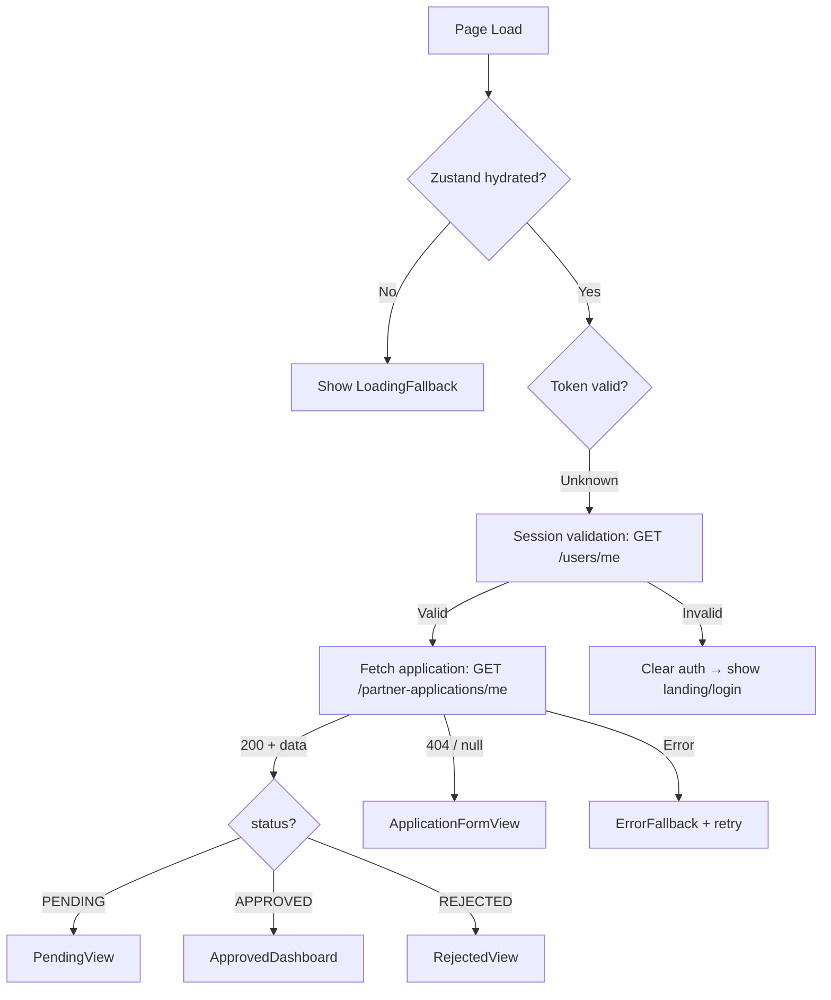

# Session & State Flow

## Architecture Overview

Auth persistence and application state are managed through three independent layers:

| Layer | Technology | Persistence | Purpose |
|-------|-----------|-------------|---------|
| Auth credentials | Zustand + localStorage | Survives browser close | JWT token + user info |
| Server state | TanStack React Query | In-memory (refetched) | Application data, dashboard |
| Permanent state | PostgreSQL (via Prisma) | Permanent | All application records |

## Auth Persistence Behavior

### Token Storage
- JWT token and user metadata are persisted to **localStorage** under key `partner-portal-auth`
- On page load, Zustand rehydrates from localStorage → `isHydrated: true`
- Token is attached to all API requests via Axios request interceptor

### Session Validation on App Mount
- After hydration, a one-time session validation fires: `GET /api/v1/users/me`
- If the stored JWT is **valid**: user profile is refreshed in the auth store
- If the stored JWT is **expired/invalid**: auth state is cleared (logout), user sees landing/login
- This prevents "flash of loading → error" when returning with a stale token

### 401 Interceptor
- Any API response with status 401 triggers:
  1. Auth store cleared (`logout()`)
  2. React Query cache cleared (`queryClient.clear()`)
- This handles mid-session token expiry gracefully

## Route Rendering Logic

### `/partner` — Dynamic State Renderer

The `PartnerPage` component uses `computeView()` which returns one of these views:

```
isHydrated?
  NO  → ApplicationSkeleton (prevents flash of wrong content)
  YES
    ├─ role === 'ADMIN'       → AdminReviewPanel
    ├─ !isAuthenticated       → LandingView (visitor)
    ├─ isReapplying           → ApplicationFormView
    ├─ isLoading              → ApplicationSkeleton
    ├─ isError                → ErrorFallback + retry button
    ├─ !application           → ApplicationFormView (no application yet)
    ├─ status === 'PENDING'   → PendingView
    ├─ status === 'REJECTED'  → RejectedView + reapply button
    ├─ status === 'APPROVED'  → ApprovedDashboard
    └─ default                → ApplicationFormView (fallback)
```

### Application status is ALWAYS fetched from the backend



## Logout Behavior

### Intentional Logout (user clicks Logout)
1. `useAuthStore.logout()` → clears `user`, `token`, `role`, `isAuthenticated`
2. `queryClient.clear()` → clears all React Query cache (prevents stale data)
3. `navigate('/login')` → redirects to login page
4. Toast: "Logged out successfully"
5. **Application state in DB is untouched**

### Forced Logout (expired token / 401)
1. Axios response interceptor detects 401
2. `useAuthStore.logout()` → clears auth state
3. `queryClient.clear()` → clears all React Query cache
4. Components re-render: protected routes redirect to login, public routes show landing

## State Restoration Flow

### After page refresh
1. Zustand rehydrates from localStorage (instant, synchronous)
2. React Query refetches all active queries (`refetchOnMount: true`)
3. Session validation fires (`/users/me`)
4. Correct view renders once data arrives

### After browser restart
Same as page refresh: localStorage persists, Zustand rehydrates, queries refetch.

### After logout → login again
1. Login API returns fresh JWT + user
2. Zustand stores new auth data
3. React Query refetches application from backend (no cache)
4. Correct view renders based on current DB state

## Test Scenarios Verified

### Scenario A: Login → Apply → Logout → Login → Pending
| Step | Action | Expected | Status |
|------|--------|----------|--------|
| 1 | Login with valid credentials | JWT stored, redirected to /partner | ✅ |
| 2 | Submit application form | POST succeeds, status = PENDING | ✅ |
| 3 | See PendingView | "Pending review" displayed | ✅ |
| 4 | Logout | Auth cleared, navigate to /login | ✅ |
| 5 | Login again | New JWT, redirected to /partner | ✅ |
| 6 | Fetch application from DB | Status still PENDING | ✅ |
| 7 | See PendingView | Correct state from DB | ✅ |

### Scenario B: Login → Apply → Admin Approves → Refresh → Dashboard
| Step | Action | Expected | Status |
|------|--------|----------|--------|
| 1 | Login + apply | PENDING application | ✅ |
| 2 | Admin approves | DB updated to APPROVED | ✅ |
| 3 | Refresh browser | Zustand rehydrates | ✅ |
| 4 | Fetch application | Status = APPROVED | ✅ |
| 5 | See ApprovedDashboard | Dashboard + codes visible | ✅ |

### Scenario C: Login → Apply → Admin Rejects → Logout → Login → Rejection
| Step | Action | Expected | Status |
|------|--------|----------|--------|
| 1 | Login + apply | PENDING application | ✅ |
| 2 | Admin rejects + provides reason | DB updated to REJECTED | ✅ |
| 3 | Logout | Auth cleared | ✅ |
| 4 | Login again | New JWT, redirected to /partner | ✅ |
| 5 | Fetch application | Status = REJECTED | ✅ |
| 6 | See RejectedView with reason | Rejection + reapply option | ✅ |

## Error Handling

| Scenario | Handling | Result |
|----------|----------|--------|
| Expired JWT | 401 interceptor → logout | Landing page or login redirect |
| Invalid token | 401 interceptor → logout | Landing page or login redirect |
| Missing/deleted user | 401 interceptor → logout | Landing page or login redirect |
| Backend unavailable | React Query error → ErrorFallback | Retry button shown |
| Network error (API call) | React Query retry (1 attempt) | ErrorFallback if still failing |

## Key Files

| File | Role |
|------|------|
| `frontend/src/store/auth.store.ts` | Zustand auth store with persist middleware |
| `frontend/src/api/client.ts` | Axios instance with auth interceptor + 401 handling |
| `frontend/src/hooks/use-session.ts` | Session validation on mount |
| `frontend/src/hooks/use-auth.ts` | Login/logout/register mutations |
| `frontend/src/hooks/use-partner.ts` | Application CRUD queries |
| `frontend/src/pages/partner/PartnerPage.tsx` | Dynamic view renderer |
| `frontend/src/components/common/ProtectedRoute.tsx` | Auth gate for protected pages |
| `backend/src/services/partner.service.ts` | Application business logic |
| `backend/src/middleware/auth.middleware.ts` | JWT verification middleware |

## Design Principles

1. **PostgreSQL is the single source of truth** for application state
2. **Zustand stores only auth credentials** (user, token, role)
3. **React Query manages all server state** with automatic refetching
4. **No frontend-only booleans or state** determine application status
5. **Logout never touches DB state** — only clears local credentials
6. **Session validation on mount** prevents silent failures with expired tokens
